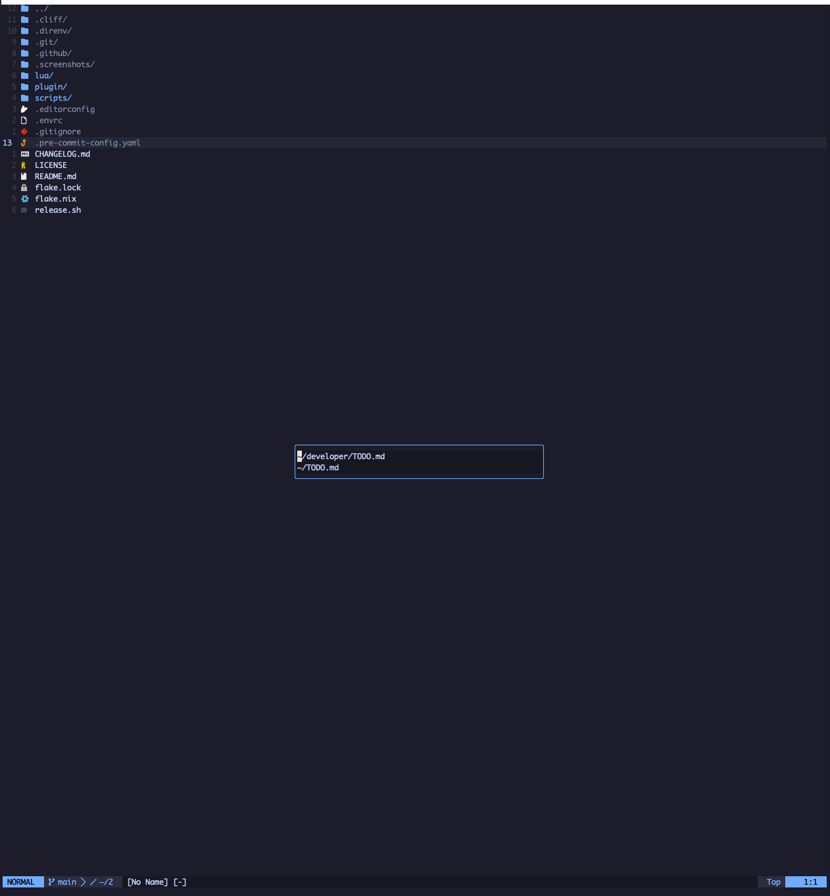
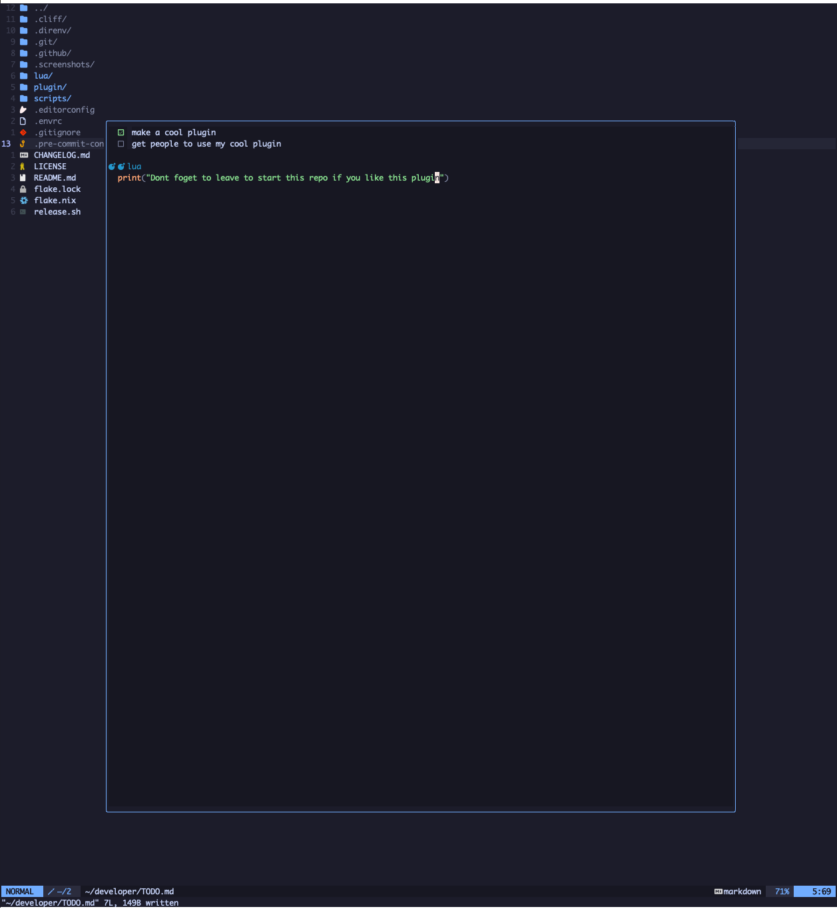

# `todo.nvim`

A minimalist Neovim plugin for editing todo files. You can start editing with `:TodoOpen`.

| Key |    Description                         |
|------|---------------------------------------|
| `<leader>to`   | Open spf TODO.md file       |

Use `<CR>` to select a file in the file picker.

<details>
    <summary>Click to expand screenshots</summary>
    <p align="center">
          
    </p>
    <p align="center">
          
          <p>IGNORE THE SPELLING LMFAO</p>
    </p>
</details>

## Setup

Add the following configuration to use `todo.nvim`.

### Installation using [Lazy.nvim](https://github.com/folke/lazy.nvim)

```lua
{
  "flokkq/todo.nvim",
  version = "v0.1.0",
}
```

### Installation using [Packer.nvim](https://github.com/wbthomason/packer.nvim)

```lua
use {
  "flokkq/todo.nvim",
  tag = "v0.1.0",
}
```

### Installation using [vim-plug](https://github.com/junegunn/vim-plug)

```vim
Plug 'flokkq/todo.nvim'
```

